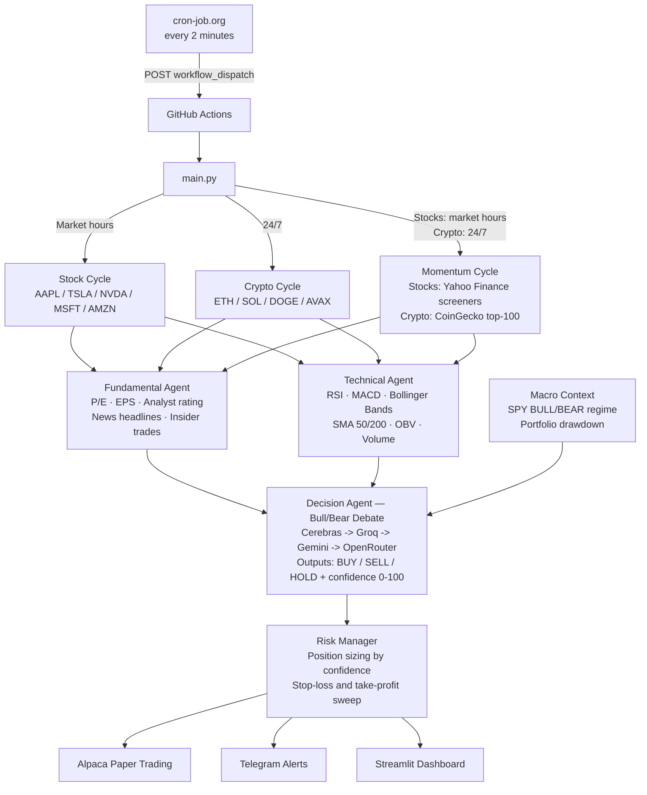
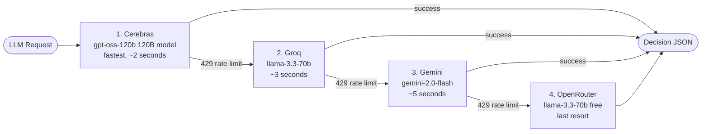
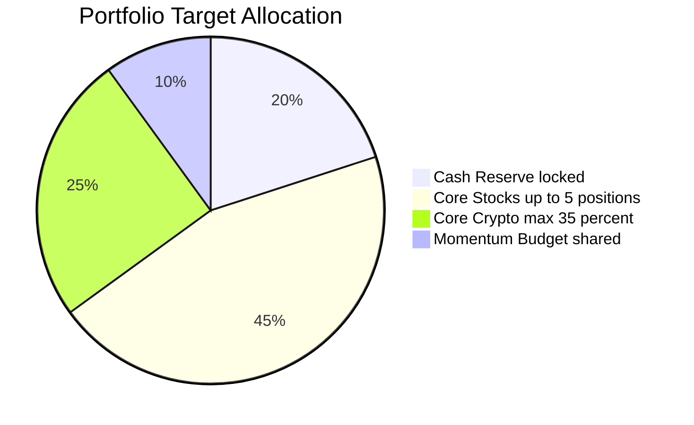
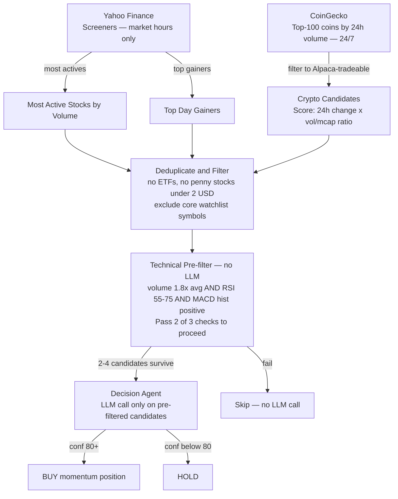
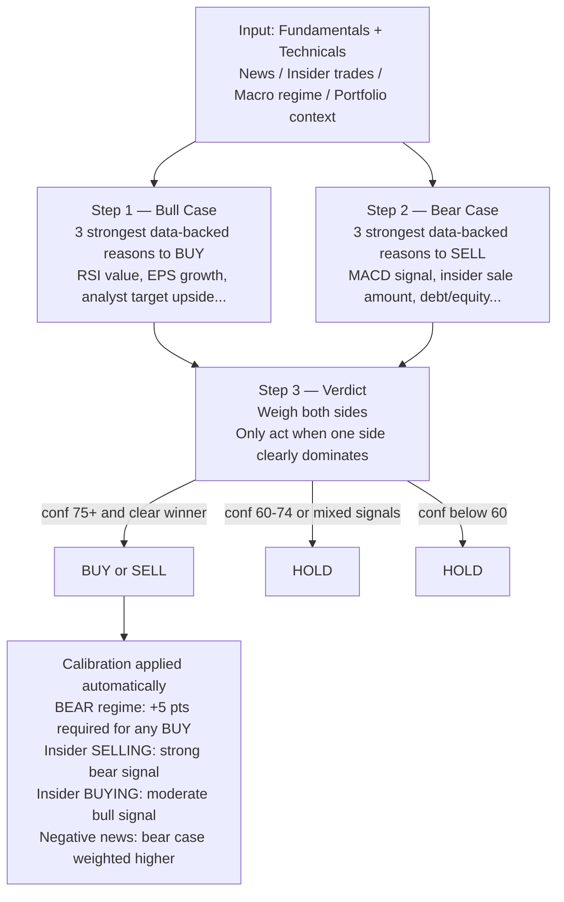
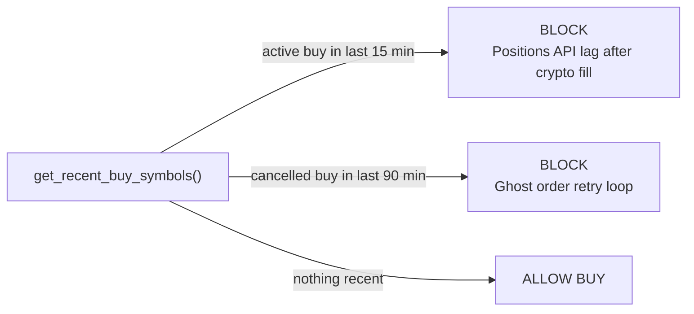

# Autonomous Multi-Agent Trading Bot

An autonomous paper trading system that runs 24/7. Three AI agents analyze stocks and crypto every 2 minutes, execute trades via Alpaca's paper API, and send Telegram alerts. No human intervention needed.

---

## System Architecture



---

## LLM Failover Chain

Every decision automatically falls through to the next provider on any 429 / quota error — the bot never fails on an LLM call during normal trading.



---

## Capital Allocation



| Tier | Budget | Rules |
|---|---|---|
| 🔒 Cash Reserve | **20%** always locked | Unlocks at confidence ≥ 88% (up to 50% of reserve per trade) |
| 📈 Core Stocks | Up to 65% investable pool | Max 5 positions · −7% stop / +15% take |
| 🔗 Core Crypto | Max 35% of total portfolio | ETH / SOL / DOGE / AVAX · −12% stop / +25% take · max 3 positions |
| 🚀 Momentum | **10%** shared budget | Live-discovered stocks (Yahoo) + crypto (CoinGecko) · −4%/+8% stops |

---

## Momentum Discovery Pipeline

Both stocks and crypto are discovered dynamically every cycle — no hardcoded ticker lists.



---

## Decision Agent — Bull / Bear Debate

Every decision follows a mandatory 3-step process before outputting any action:



**Sample output:**
```json
{
  "symbol": "NVDA",
  "action": "HOLD",
  "confidence": 62,
  "bull_case": [
    "RSI 37 approaching oversold — historically reversal zone",
    "Analyst consensus strong_buy, target $298 = 46% upside from $205",
    "Revenue growth 85.2%, earnings growth 214% — exceptional fundamentals"
  ],
  "bear_case": [
    "MACD histogram −5.42, signal line bearish for 3 weeks",
    "Insider STEVENS MARK A sold 1,000,000 shares ($221M) on 2026-06-04",
    "BEAR regime active — SPY below SMA20, confidence bar raised +5pts"
  ],
  "rationale": "Insider sale of $221M outweighs technical oversold setup. Bear side wins on insider signal alone. Waiting for regime to flip BULL before entering.",
  "time_horizon": "hold"
}
```

---

## Watchlists

### Core Stocks (editable via dashboard)
| Symbol | Company | Stop | Target |
|--------|---------|------|--------|
| AAPL | Apple | −7% | +15% |
| TSLA | Tesla | −7% | +15% |
| NVDA | NVIDIA | −7% | +15% |
| MSFT | Microsoft | −7% | +15% |
| AMZN | Amazon | −7% | +15% |

### Core Crypto (fixed — runs 24/7)
| Symbol | Asset | Stop | Target |
|--------|-------|------|--------|
| ETH/USD | Ethereum | −12% | +25% |
| SOL/USD | Solana | −12% | +25% |
| DOGE/USD | Dogecoin | −12% | +25% |
| AVAX/USD | Avalanche | −12% | +25% |

> **Note:** BTC/USD is excluded — Alpaca paper trading accepts BTC orders but never fills them (65 cancelled orders, 0 filled). The dedup guard blocks any symbol with a recently-cancelled buy for 90 minutes, preventing infinite retry loops.

### Momentum Crypto (dynamic — via CoinGecko)
No hardcoded list. Every cycle the bot queries CoinGecko's top 100 coins by 24h volume, filters to Alpaca-tradeable symbols, scores each by `24h_change × (1 + volume/marketcap_ratio × 10)`, and picks the top 3 positive-momentum candidates. Exits: −6% stop / +12% take.

---

## Risk Management

### Position Sizing — scales with LLM confidence

| Confidence | Cash Deployed | When Used |
|---|---|---|
| 65 – 79% | 5% of investable cash | Moderate signal, some uncertainty |
| 80 – 89% | 10% of investable cash | Strong signal, most data aligned |
| ≥ 90% | 20% of investable cash | Overwhelming evidence |
| ≥ 88% | Unlocks reserve too | Up to 50% of the 20% reserve |

*Investable cash = `available_cash − (portfolio_value × 0.20)`* (reserves always excluded)

### Stop-Loss / Take-Profit by Tier

| Tier | Stop-Loss | Take-Profit | Rationale |
|---|---|---|---|
| Core Stocks | −7% | +15% | Hold through normal volatility |
| Core Crypto | −12% | +25% | Crypto needs wider room |
| Momentum Stocks | −4% | +8% | Short-term wave riding |
| Momentum Crypto | −6% | +12% | Fast in, fast out |

---

## Ghost Order Protection

The dedup guard prevents two specific failure modes:



This replaced the old logic that only tracked non-cancelled orders, which caused BTC/USD to be re-ordered every 18 minutes in a loop (65 phantom orders, 0 filled).

---

## File Structure

```
trading_bot/
│
├── main.py                 # Entry point — single cycle (GitHub Actions) or --daemon loop
├── config.py               # All tuneable constants — push a change, next cycle picks it up
├── env_loader.py           # Manual .env parser — no python-dotenv needed
├── watchlist.json          # Stock watchlist — editable via dashboard without redeploying
│
├── orchestrator.py         # Wires all agents + execution into one cycle
│                           #   _run_stock_cycle()     market hours only
│                           #   _run_crypto_cycle()    24/7
│                           #   _run_momentum_cycle()  screener → pre-filter → LLM
│                           #   _build_macro_context() SPY regime + drawdown for LLM
│
├── agents/
│   ├── fundamental_agent.py  # yfinance: fundamentals + news headlines + insider transactions
│   ├── technical_agent.py    # RSI, MACD, Bollinger Bands, SMA50/200, OBV via ta library
│   └── decision_agent.py     # 4-provider LLM failover + mandatory bull/bear debate
│
├── execution/
│   ├── alpaca_client.py      # Alpaca Paper Trading REST wrapper
│   │                         #   get_recent_buy_symbols()    dedup guard (15 min / 90 min)
│   │                         #   cancel_stale_open_orders()  kills stuck GTC crypto orders
│   ├── risk_manager.py       # Stop-loss, take-profit, position sizing, cash reserve
│   ├── market_scanner.py     # Stock discovery: Yahoo screeners (most_actives + day_gainers)
│   │                         # Crypto discovery: CoinGecko top-100, scored by momentum
│   └── telegram_notifier.py  # Trade alerts, risk exits, EOD summary, heartbeat
│
├── dashboard/
│   └── app.py              # Streamlit — 6-tab layout, auto-refreshes every 10s
│                           #   Overview · Positions · Momentum · History · Reports · Prices
│
├── .github/workflows/
│   └── trading_bot.yml     # GitHub Actions — triggered by cron-job.org every 2 min
│                           #   uses requirements-bot.txt
│
├── requirements.txt        # Dashboard only (Streamlit Cloud) — plotly, streamlit-autorefresh
└── requirements-bot.txt    # Full bot (GitHub Actions) — adds cerebras-cloud-sdk
```

---

## Dashboard

Live at **[trading-bot-test.streamlit.app](https://trading-bot-test.streamlit.app)** — auto-deploys on every push to `main`.

```
┌─ 8 KPI Metrics ──────────────────────────────────────────────────────────┐
│  Portfolio │ Cash │ Total P&L │ Positions │ Win Rate │ PF │ Weekly │ Mom │
├───────────────────────────────────────────────────────────────────────────┤
│ [📊 Overview] [💼 Positions] [🚀 Momentum] [📜 History] [📋 Reports]      │
│ [📡 Prices]                                                               │
│                                                                           │
│  Overview   Performance chart + Allocation pie + P&L bar                 │
│  Positions  Merged table (stocks + crypto) with stop/target cols         │
│  Momentum   Budget strip → Live Screener │ Signal Filter │ Trades        │
│  History    Trade log — filter: All / Stocks / Crypto                    │
│  Reports    Realized P&L · filters: Side / Range / Type (By Day or Flat) │
│  Prices     Live price tiles (stocks + crypto) + performance stats       │
└───────────────────────────────────────────────────────────────────────────┘
```

Run locally:
```bash
streamlit run dashboard/app.py
```

---

## Telegram Alerts

**Trade Alert:**
```
🟢 TRADE ALERT — BUY NVDA
Units:      12 shares @ $875.20  |  Cost: $10,502.40
Confidence: 82%

📊 RSI 28.4 OVERSOLD · MACD BULLISH · Volume 2.3× avg
🏢 Strong Buy · target $950 (+8.5%) · Revenue +122%
💬 RSI oversold + golden cross + analyst upgrades
Cash left: $52,800.00
```

**Risk Exit:**
```
⚠️ RISK EXIT — SELL TSLA (STOP LOSS −7.2%)
Units: 8
```

**Hourly Heartbeat** (no trades that hour):
```
🤖 BOT HEARTBEAT  ·  no trades this hour
Portfolio: $99,786  ·  Cash: $17,232  ·  P&L: 📉 −$214
```

**End-of-Day Summary:**
```
📅 END OF DAY SUMMARY
Trades: 3 buys  1 sell  ·  Day P&L: 📈 +$234.50
Portfolio: $100,234.50  ·  Cash: $68,120.30
```

---

## Hosting

### GitHub Actions + cron-job.org (current — free)

[cron-job.org](https://cron-job.org) fires a `workflow_dispatch` POST every 2 minutes. GitHub Actions runs the cycle and exits.

**cron-job.org setup:**
- URL: `https://api.github.com/repos/{owner}/{repo}/actions/workflows/trading_bot.yml/dispatches`
- Method: `POST`
- Headers: `Authorization: Bearer {github-pat}` · `Accept: application/vnd.github+json`
- Body: `{"ref":"main"}`

**LLM quota at 2-minute intervals:**

| Provider | Free Limit | Est. Daily Usage | Headroom |
|---|---|---|---|
| Cerebras | ~60 req/min | ~4/min | ✅ 15× headroom |
| Groq | 14,400/day | ~5,760/day | ✅ 2.5× headroom |
| Gemini | 1,500/day | overflow only | ✅ rarely touched |
| OpenRouter | generous | last resort | ✅ never normally hit |

### AWS EC2 (alternative)
```bash
python3 main.py --daemon   # runs every 60 sec during market hours
```

---

## Configuration (`config.py`)

```python
# Core watchlists
WATCHLIST        = ["AAPL", "TSLA", "NVDA", "MSFT", "AMZN"]
CRYPTO_WATCHLIST = ["ETH/USD", "SOL/USD", "DOGE/USD", "AVAX/USD"]  # BTC excluded — never fills

# Position limits
MAX_POSITIONS        = 5
MAX_CRYPTO_POSITIONS = 3
CRYPTO_PORTFOLIO_CAP = 0.35             # max 35% of portfolio in crypto

# Core exits
STOP_LOSS_PCT          = 0.07           # −7%  stock stop-loss
TAKE_PROFIT_PCT        = 0.15           # +15% stock take-profit
CRYPTO_STOP_LOSS_PCT   = 0.12           # −12% crypto stop-loss
CRYPTO_TAKE_PROFIT_PCT = 0.25           # +25% crypto take-profit

# Capital guardrails
MIN_CASH_RESERVE_PCT      = 0.20        # always keep 20% locked
RESERVE_DEPLOY_CONFIDENCE = 88          # unlock reserve at ≥88% confidence
RESERVE_MAX_DEPLOY_PCT    = 0.50        # max 50% of reserve per trade

# Momentum tier
MOMENTUM_TOTAL_BUDGET_PCT = 0.10        # 10% shared budget
MOMENTUM_MIN_CONFIDENCE   = 80          # higher bar than core 65%
MOMENTUM_VOLUME_RATIO_MIN = 1.8         # 1.8× avg volume required
MOMENTUM_STOCK_STOP_PCT   = 0.04        # −4% (tighter than core)
MOMENTUM_STOCK_TAKE_PCT   = 0.08        # +8%
MOMENTUM_CRYPTO_STOP_PCT  = 0.06
MOMENTUM_CRYPTO_TAKE_PCT  = 0.12

# LLM — 4-provider automatic failover
MIN_CONFIDENCE   = 65
CEREBRAS_MODEL   = "gpt-oss-120b"                          # primary ~2s
GROQ_MODEL       = "llama-3.3-70b-versatile"
GEMINI_MODEL     = "gemini-2.0-flash"
OPENROUTER_MODEL = "meta-llama/llama-3.3-70b-instruct:free"
```

### Tuning Guide

| Goal | Setting to change |
|---|---|
| Bot trades too rarely | Lower `MIN_CONFIDENCE` to 60 |
| Bot trades too aggressively | Raise `MIN_CONFIDENCE` to 75 |
| Stop-outs too frequent | Raise `STOP_LOSS_PCT` |
| Lock in gains faster | Lower `TAKE_PROFIT_PCT` |
| More momentum trades | Lower `MOMENTUM_MIN_CONFIDENCE` to 75 |
| Less crypto exposure | Lower `CRYPTO_PORTFOLIO_CAP` to 0.20 |
| More dry powder | Raise `MIN_CASH_RESERVE_PCT` to 0.30 |

---

## Required Credentials

```bash
# Alpaca Paper Trading — app.alpaca.markets
ALPACA_API_KEY=...
ALPACA_SECRET_KEY=...
ALPACA_BASE_URL=https://paper-api.alpaca.markets/v2

# LLM failover chain
CEREBRAS_API_KEY=...      # cloud.cerebras.ai   — fastest, 120B model, free
GROQ_API_KEY=...          # console.groq.com    — 14,400 req/day free
GOOGLE_API_KEY=...        # aistudio.google.com — 1,500 req/day free
OPENROUTER_API_KEY=...    # openrouter.ai       — free tier, last resort

# Telegram
TELEGRAM_BOT_TOKEN=...    # from @BotFather
TELEGRAM_CHAT_ID=...      # from api.telegram.org/bot{token}/getUpdates
```

Add all as **GitHub Repository Secrets** (Settings → Secrets → Actions). Never committed to the repo.

---

## Dependencies

| File | Used by | Contents |
|---|---|---|
| `requirements.txt` | Streamlit Cloud (dashboard) | yfinance · ta · google-genai · requests · pandas · numpy · plotly · streamlit-autorefresh |
| `requirements-bot.txt` | GitHub Actions (trading bot) | all of the above + cerebras-cloud-sdk |

```bash
pip install -r requirements-bot.txt   # for running the bot locally
```

---

## Inspiration & References

This bot was designed by studying the architectures and research behind several leading open-source trading AI projects. Key learnings from each:

### Research Papers & Repositories

| Project | What We Borrowed |
|---|---|
| [**TradingAgents**](https://github.com/tauricresearch/tradingagents) — Tauric Research | Multi-agent bull/bear debate before any decision. Forced the LLM to argue both sides with specific data points before committing. Directly inspired our `SYSTEM_PROMPT` structure. |
| [**FinceptTerminal**](https://github.com/Fincept-Corporation/FinceptTerminal) — Fincept Corp | Evaluated for fundamental + alternative data connectivity. Decided against integrating (C++20 desktop app, not pip-installable, $10,200/yr commercial licence) but the data source ideas influenced what fields we pull from yfinance. |

### Data Sources

| Source | Used For |
|---|---|
| [Yahoo Finance (yfinance)](https://github.com/ranaroussi/yfinance) | Stock + crypto prices, fundamentals (P/E, EPS, growth, analyst ratings), news headlines, insider transactions, technical history |
| [Yahoo Finance Screeners](https://finance.yahoo.com/screener) | Momentum stock discovery — `most_actives` and `day_gainers` screeners surface what's actually moving each cycle |
| [CoinGecko API](https://www.coingecko.com/en/api) | Momentum crypto discovery — top 100 coins by 24h volume, scored by price change × volume/market-cap ratio |
| [Alpaca Paper Trading API](https://alpaca.markets) | Order execution, position tracking, account state, portfolio history |
| [SPY via yfinance](https://finance.yahoo.com/quote/SPY) | Market regime detection — BULL when SPY > SMA20, BEAR when below |

### LLM Providers

| Provider | Model | Role |
|---|---|---|
| [Cerebras](https://cloud.cerebras.ai) | gpt-oss-120b | Primary — wafer-scale chips, fastest inference (~2s), 120B reasoning model |
| [Groq](https://console.groq.com) | llama-3.3-70b-versatile | Secondary — dedicated LPU silicon, very fast |
| [Google Gemini](https://aistudio.google.com) | gemini-2.0-flash | Tertiary — reliable fallback |
| [OpenRouter](https://openrouter.ai) | llama-3.3-70b:free | Last resort — routes to 100+ models |

### Libraries

| Library | Used For |
|---|---|
| [ta](https://github.com/bukosabino/ta) | Technical indicators (RSI, MACD, Bollinger Bands, SMA, OBV) |
| [cerebras-cloud-sdk](https://github.com/Cerebras/cerebras-cloud-python) | Official Cerebras Python SDK |
| [streamlit](https://streamlit.io) | Live trading dashboard |
| [plotly](https://plotly.com/python) | Interactive charts in dashboard |
